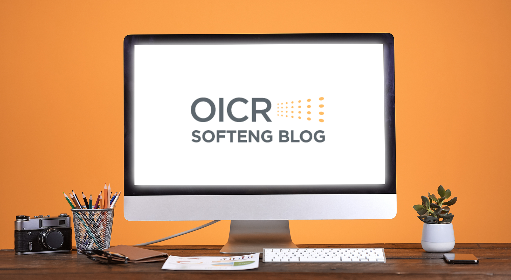

# :newspaper: OICR Engineering Blog Writing Guide

<a href="https://softeng.oicr.on.ca/"></a>

<br />

**Hello all!**

The following guide is for clarity on writing posts for the blog. It is not prescriptive. Here you can find information on:

1. [Determining a topic](#thought_balloon-determining-a-topic)

2. [Writing to an audience](#memo-writing-to-an-audience)

3. [Structuring your blog post](#dart-structuring-your-blog-post)

    - [General tips](#general-tips)
    - [Problem Centered Template](#problem-centered-post)
    - [Wiki Template](#wiki-post)
    - [Conversational Template](#wiki-post)
4. [Citing sources](#citing-sources)

<br />

# :thought_balloon: Determining a Topic

Three simple steps when stuck on ideas:

1. Start with your reader.

    - What problems does your reader experience?
    - What questions are they asking? 

<br/>

2. Jot a list of everything that comes to mind.

</br>

3. Pick and Google one of these problems and take note of the top three search results.
    - How have these search results phrased the problem?
    - How are they solving the problem?
    - Does that change your approach to the article?

<br />

# :memo: Writing to our Audience

- This blog's target audience is you. You are writing for yourself
- Be yourself, do not say anything in writing that you wouldn't say in conversation

- Beware of the ***curse of knowledge***:
    
    > <br />
    > A bias that occurs when an individual, who is communicating with other individuals, assumes that the other individuals have the background knowledge to understand.
    >
    > <br />

<br />

- You are the expert in your domain/topic. Wherever possible, simplify your language and provide background for your reader (in-text or hyperlinked).

<br />

# :dart: Structuring your blog post

## General tips:

- **Keywords:** It's good practice to incorporate keywords in your ```<h1>``` and other headers 

- **Headers:** Everyone's friend when reading online is the header; they divide the material, structure it, and let readers learn more when skimming

- **Short Paragraphs:** When online, large blocks of text create a barrier to engaging readers. You enable readers to skim and gather more information with brief paragraphs, on average 3 sentences, typically no more than five or six
    - Sentences (~ 25 words) 
    - Paragraphs (~ 3 sentences no more than 6)

- **Length:** Based on SEO metrics articles roughly 1500-2500 words tend to do best however this is a large word count and is not absolutely required. ***Tailor as needed.***
    
- **Hyperlinks:** By doing so, extraneous background information can be reduced while still enabling a wider audience to follow along.

<br />

## Problem Centered Post

**Description** Present a problem that your reader is experiencing, empathize with that problem, and then solve the problem.

**Approximate word count:** 1500-2500 words. *Tailor as needed.*

:memo: **Google Docs:** [Problem Centered Post Template](https://docs.google.com/document/d/1BStxDjG_iGDc1m-pgOxnMNsh3e5oRmD4llS9DLe92k0/edit?usp=sharing)

**Titles:** Information on creating a title can be found within the google doc. 

## Wiki Post

**Description:** Gain readers, establish your expertise on a subject, and help many people along the way. Content from wikis or encyclopedias, particularly material Wikipedia hasn't covered, is also a huge benefit for gaining search traffic. Keep in mind that this is still a blog post, not a Wikipedia article.  

**Approximate word count:** 1500-2500 words. *Tailor as needed.*

 :memo: **Google Docs:** [Wiki Post Template Linked Here](https://docs.google.com/document/d/1BEra-ugD4ETTv_9WQNOwGhMBgry7yeYnW5TEzmDb7Bs/edit?usp=sharing)

 **Titles:** Information on creating a title can be found within the google doc. 

## Conversational Post

**Description:** Spark engagement with readers by creating a thought provoking conversational piece.

**Approximate word count:** 1500 words.  *Tailor as needed.*

:memo: **Google Docs:** [Conversational Post Template](https://docs.google.com/document/d/1_-hJgzEvtFbCwIfn6hrhhojI-mYaFZ-NJ0bWnDqExgM/edit?usp=sharing)

**Titles:** Information on creating a title can be found within the google doc. 

<br />

# :pencil: Citing Sources

- Simple hyperlinks for any referenced web content within the article 

- If citing a journal article use [APA](https://www.grammarly.com/citations?utm_source=google&utm_medium=cpc&utm_campaign=bts2022-citations-ps-cg&gclid=EAIaIQobChMIm6Kgh_Xs-wIVz8mUCR0-yQGMEAAYASAAEgLu__D_BwE&gclsrc=aw.ds)


    - last name, first name initial., ..., ..., & last name, first name initial. title of article. *title of journal*, volume(Issue), page(s).DOI

*Example*

Tolufi, M., Boreman, N., & ,Trotsky D. (2040). The computer goes beep. *Advanced computer systems America*, 5(2), 161. < insert doi link >

*In-text citation:* (Tolufi et al., 2040)

*If two authors:* (Tolufi & Boreman., 2040)